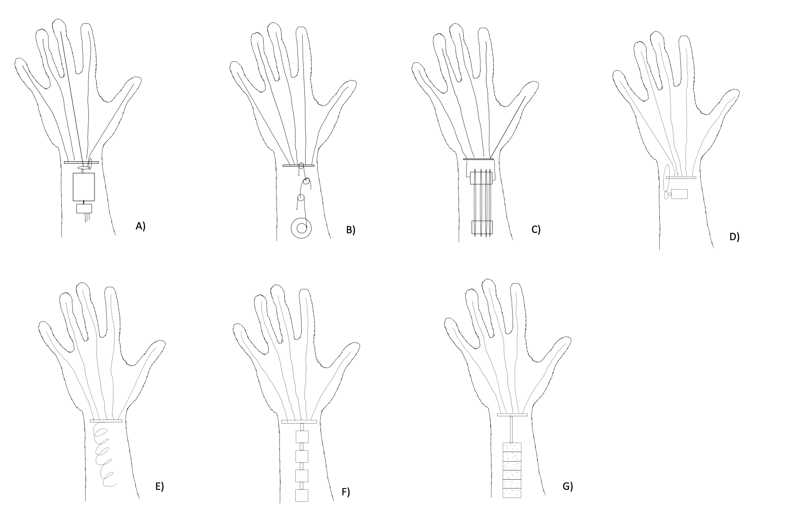
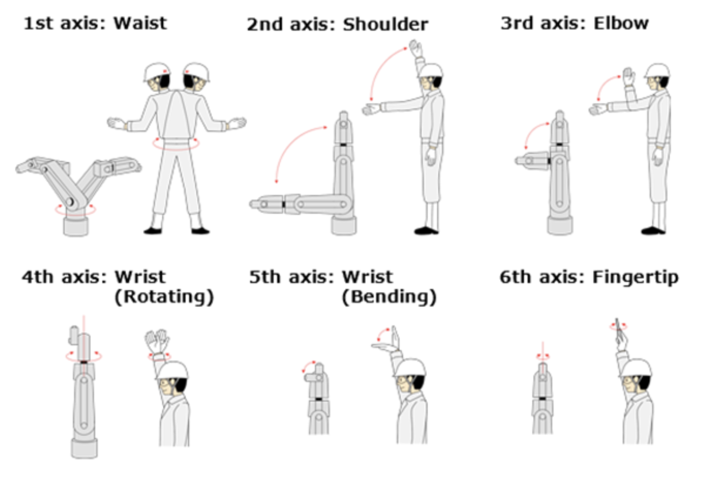

# **Robotic Hand Brainstorm**  

## **Crush (Strength-Focused Design)**  

### **Key Attributes**  
- **Gearbox (High Gear Ratio)**
  - Planetary gearbox  
  - Reducer  
- **Hydraulics**  
- **Pulleys**  

### **Concept Ideas**  
- Planetary Gearbox Arm  
- Block-and-Tackle Arm  
- Compound Pulley Arm  

## **Quiet (Noise Reduction Design)**  

### **Key Attributes**  
- **Electroactive Polymers (EAP)**
  - **Ionic:**  
    - Carbon Nanotubes  
    - Conductive Polymers  
    - Ionic Pollen Rachels  
    - Ionic Polymer Metallic Composite  
  - **Electronic:**  
    - Dielectric Elastomer EAP  
    - Electrostrictive Paper  
    - Ferroelectric Polymers  
- **Nitinol (Shape Memory Alloy)**  
- **Helical Gear (Quieter than Standard Gears)**  

### **Concept Ideas**  
- Nitinol Arm  
- Helical Gear Arm  
- Solenoid Actuator #1 Arm  
- Solenoid Actuator #2 Arm  

## **Quick (Speed-Focused Design)**  

### **Key Attributes**  
- **Gearbox (Low Gear Ratio)**  
- **Brushless Motors**  
- **Weight Optimization** (Move motors to base)  
- **Pulleys**  
- **Helical Gear (Used in High-Speed Applications)**  

### **Concept Ideas**  
- Pulley Arm  
- Brushless Motors Arm  
- Helical Gear Arm  

 

## **Final Concept Selections**  
✔️ Planetary Gearbox Arm  
✔️ Compound Pulley Arm  
✔️ Block-and-Tackle Arm  
✔️ Brushless Motors Helical Gear Arm  
✔️ Nitinol Arm  
✔️ Solenoid Actuator #1 Arm  
✔️ Solenoid Actuator #2 Arm  

  

## **Motor Research**  
- Power Efficiency  
- Speed Performance  
- Heat Management  

## **Resources**  

### **YouTube References**  
📺 [What is an Actuator?](https://youtu.be/LHn7O6PUaoY)  
📺 [Why Snatch Blocks are AWESOME (How Pulleys Work) - Smarter Every Day 228](https://www.youtube.com/watch?v=M2w3NZzPwOM&ab_channel=SmarterEveryDay)  
📺 [You've Never Seen a Robot Joint Like This!](https://www.youtube.com/watch?v=utDagouxM5U&ab_channel=SkyentificSkyentific)  

  

