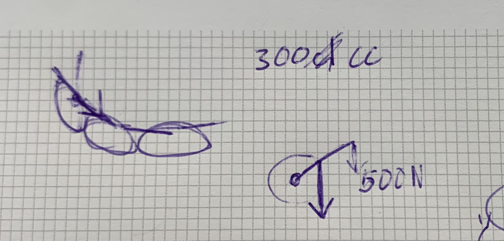

# **Robotic Hand Options & Equations**  

## Options
    
### Crush (Parts)

- Motors
- Solenoid Actuators
- Nitinol
- Pulleys

### Motor Constraints
- Possible to create 0.5Nm of torque with pulley or gearbox
- Less than 7.4V and 1.4Amps

## Motor Force Equation

**Force:** $(F=ma)$

**Torque**: $(T=Fd)$

**Watts**: $(W=V \times Amps)$

**Newton**: $(F=\frac{T}{d})$

---

- **Horsepower**: $(Hp= W \times EFF \times PF \times 1.73 / 746)$
    
    **Efficiency**: $(EFF = 0.90)$
    
    **Power Factor**: $(PF=0.85)$

---

**Torque Equation 1 (Ft-lb)**: $(T=\frac{(Hp)(5252)}{Rpm})$
**Torque Conversion**: $(Ft)-(lb = 1.36 Nm)$
    
| Motor Type              | Voltage (V) | Current (A) | Power (W) | RPM   | Torque (Nm)    | Torque (lb-in) |
| ----------------------- | ----------- | ----------- | --------- | ----- | -------------- | -------------- |
| Battery Specs Motor     | 7.4         | 3           | 22.2      | 19000 | 0.039384168901 | 0.014805794258 |
| Current Motor           | 7.4         | 1.6         | 11.84     | 10000 | 0.02100489008  | 0.015003204847 |
| DC Motor: Mini DC Motor | 3           | 0.09        | 0.27      | 19000 | 0.000478996649 | 0.000180070471 |
| Brushless Motor         | 14          | 15          | 210       | 18200 | 0.372552949062 | 0.146211065952 |
| (Unnamed Motor)         | 14          | 30          | 420       | 19000 | 0.745105898123 | 0.280109621086 |

---

**Torque Equation 2 (Nm)**  $(T=\frac{(W)(EFF)(60)}{(2\pi)(Rpm)})$

| Motor Type              | Voltage (V) | Current (A) | Power (W) | RPM   | Torque (Nm)    | Torque (oz-in)  | Torque (g-cm)   |
| ----------------------- | ----------- | ----------- | --------- | ----- | -------------- | --------------- | --------------- |
| Battery Specs Motor     | 7.4         | 3           | 22.2      | 19000 | 0.010046932618 | 1.55727455579   | 18.68729466948  |
| Current Motor           | 7.4         | 1           | 7.4       | 10000 | 0.006363057325 | 0.986273885375  | 11.8352866245   |
| DC Motor: Mini DC Motor | 3           | 0.09        | 0.27      | 19000 | 0.000122192424 | 0.01893982572   | 0.22727790864   |
| Brushless Motor         | 14          | 15          | 210       | 18200 | 0.099216070554 | 15.37849093587  | 184.54189123044 |
| (Unnamed Motor)         | 14          | 30          | 420       | 19000 | 0.190077103587 | 29.461951055985 | 353.54341267182 |

---

## Finger Force

**Goal Force** $(= 500N)$

**Goal Torque** $(= Fd = (500)(0.001) = 0.5Nm)$

**Actual Torque** $(= Fd = (500)(0.082) = 41.0Nm)$

It is starting with the goal torque in the fingertip and moving backwards.

### **Visualize**

| Tip Length (m) | Radius of Rotation (m) | Radius to Tip (m) | Torque at End of tip (Nm) | Torque at Connection (Nm) |
| ----------- | ----------- | ----------- | ----------- | ----------- |
| 0.025       | 0.01        | 0.02        | 12.5        | 1250        |

    
### **Motor Needs**
    
- 12V 16mm
    
## Cycloidal Reducer

- **LINKS**
    
    [Cycloidal Gear Drive - Animation⚙️](https://www.youtube.com/watch?v=98_L0r85Vhc)
    
    [Interesting Speed Reducer](https://www.youtube.com/watch?v=ie2wwAnKDM0&t=90s)
    
    - **Reducers**
        - Cycloidal Gear/Reducer/Drive
        - Hypocycloid Reducer
        - Harmonic Drive/Reducer
        
[Cycloidal Drive - Wikipedia](https://en.wikipedia.org/wiki/Cycloidal_drive#/media/File:Cycloidal_drive.gif)

### Ratio

- **P** - Number of pins on the chassis
- **L** - Number of lobes on the disk
- The number of lobes determines the reduction ratio.

# Finger Summary

> Goal is to find the current hand's force created by a singular finger
> 

### Top-Down Approach (Finger)

- **Goal Force** $= 500N$
- **Current Finger** - Length of 82mm or 0.082m
    
    has a cable attached to a solid locationv   
    
- **Goal** **Torque with Current Finger** $= Fd = (500)(0.082) = 41.0Nm$

### Bottom-Up Approach (Motor)

- **Motor Specs**
    - Volts - 7.4
    - Amps - 1
    - Rpm - 10,000
    - %$EFF = 0.90$
- **Motor Torque Equation**
    - $T=\frac{(W)(EFF)(60)}{(2π)(Rpm)}$
    - $T=\frac{((7.4)(1))(0.90)(60)}{(2π)(10,000)}$
    - $T=0.00635983Nm$
- **Gearbox (Effect)**
    - $T_1=T(155)$
    - $T_1=0.98577388Nm$
- **Wormgear (Effect)(Final Torque)**
    - $T_2=T_1(12)$
    - $T_2= 11.8292866Nm$
    
- **Calculate Force**
    - $m=0.082m$
    - $T_2= 11.8292866Nm$
    - $T=Nm$
    - $F=N$
        - $F=\frac{T}{m}$
    - $F=\frac{11.8292866Nm}{0.082m}$
    - $F=144.33268N$
- **Newton to Pounds**
    - $(1)lb=\frac{1}{4.448}N$
    - $32.449lb=\frac{144.33268N}{4.448}$

> This is obviously not correct because the current finger can't support anything near that weight. However before added the worm gear it was would've supported 2.7lb. which is much more realistic.
>