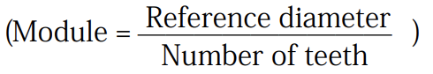
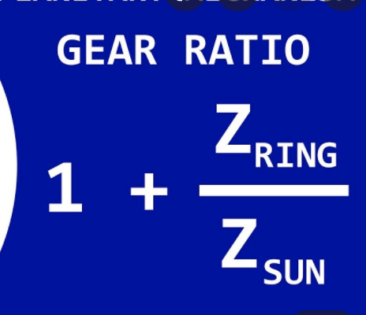
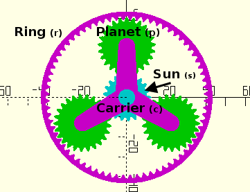

# Robotic Hand Brushless Motors & Reducers

## Key Constraints

- Needs to a total of **41 Nm of Torque**
    - $Fd = (500)(0.082) = 41.0Nm$
- **Less than 2kg**, with a preference for **less than 1 kg**
- **Average hand size** length 7.6 in, width 3.5 in, circumference 8.6 inches, thickness 0.8 in
    - length - 193.04mm, width - 88.9mm circumference - 218.44mm, thickness - 20.32mm

## Motor Options

[28mm 30kgfcm Torque 12v 24v Brush Geared Dc Motor With Encoder - Buy Dc Motor Encoder,Dc Motor With Encoder,Dc 12v 24v Encoder Gear Motor Product on Alibaba.com](https://www.alibaba.com/product-detail/28mm-12v-Brush-Motor-Brush28mm-12v_60163731769.html?spm=a2700.galleryofferlist.normal_offer.d_title.36c0327a291Mn7&s=p)

[DC6V 12V 24V JGY370 Large Torque Turbo Worm Gear Motor with Metal Gearbox 8*18mm | eBay](https://www.ebay.com/itm/332409870025?_trkparms=ispr%3D1&hash=item4d652c16c9:g:YzEAAOSw02Fchikf&amdata=enc%3AAQAGAAACwPYe5NmHp%252B2JMhMi7yxGiTJkPrKr5t53CooMSQt2orsSprd4IgPv6LBzlteBBg9Pewi2BRcaTNWtxBFupQe9ODIxIbn%252FRYA0DerNElUd8zVL5Is7argqxm3%252BBbYlpbVK5QZiE2WrwJGEx%252BajOkwjOuPueedv%252Ba9tJSJD4qIIQYxU2WYYAC1XxCE7dAMceP7j3i2wqzorttRRUsae7X2f8CbDVZJ2suPgw2dqeeCwmXzM5T6EcWl2sDf8N1c%252FKCgYP%252FgHa9XwrUR5gcT9NZ5KCb%252Bjl4NnaEkxD94Zjc8dpq0YsTms1p8MNyTkbmWZCIeN97Gj1s6PfSeTipTxF%252FQj6IBN4u0moUx%252Fat60L67kKcI4uC3PuvLKrWfMfQZykAUqgcEierAW8k%252B08%252B1kS%252Bksqu9PfDGr%252FfPsEQFsHuMLgg9wAcpUSuGHn3WaE5vzyqJ%252FM%252B%252FuPKBuUJYf7SpqqJFdWuPLlccyPPt8qVUivkEz9u0pqTLmUSzopCy9AfVy0bBXZyaVa9U26nxmEgBozZuYQ6%252FpHXp3Gt2H1IA3cJjtM%252FgGNTcH27uP2H7F3gDcU8JJ74eX4t%252B760OCoRVDgvQ9eyIMnGcSiw3G1ZiKIxjYNCf7D9srLJSO5puz6tQDHZTAhuaxehyqYCisnJhHhxI3zsCz29b%252ByBYmArJezIRvSKqPqOOKXWbcUkHvY7Ml6iLd91bB5L5SmYMIJ77Pqzj8cxP5bOpNZygEZNVt2A5vHRqmczYZxcnPXYen3ITfQ9xPosGC6VQiQbreqMz1hpuEQy81qJkcWV3400yx%252Fsg8XOf3yMD9JZgD8xFKmjYoH%252BnOcY66aSxEoKkwsjSOXD3xjGxydC559oDDh5R8nl4st7HEyoX%252FFLIxVI%252Bma11a027LHjf4vu4WhfjLRS10NOyNhObU1ssJRIrF27HgTYtPZ68k%7Campid%3APL_CLK%7Cclp%3A2334524)

## Battery

## Force

**Goal Force** $= 500N$

**Goal Torque** $= Fd = (500)(0.001) = 0.5Nm$

**Actual Torque** $= Fd = (500)(0.082) = 41.0Nm$

**Current Motor Specs**

**Torque $=3.43Nm$**

**Rpm $=6rmp$**

0.09m

## Planetary Gear

- **Ratio**
    - Planet (4:1-T=39)(3:1-T=20)
    - Sun (4:1-T=39)(3:1-T=60)
    - Ring (4:1-T=78)(3:1-T=80)
    - Ring = Sun+Planet
    - (if Planet = 40 and Sun = 10 then its a 4:1 ratio)
    

## Fingers

- 18.2+6.6=24.8→ 49.6

- **My Gearing Plan**
    - (Torque need to be increase by at least 12 times)
    - I plan to use one $(4:1)$ and $(3:1)$  planetary gears back to back
    - This is $T=(3.5)*(3.5)=12.25$ or a $(12.25:1)$ gear ratio
    - (4:1) (Mod = 0.6) (H=6mm)
        - $Sun=26$ teeth (D=15.6mm)
        - $Planet=26$ teeth (D=15.6mm)
        - $Ring=78$ teeth (D=46.8mm)
    - (3:1) (Mod = 0.6) (H=6mm)
        - $Sun=40$ teeth (D=24mm)
        - $Planet=20$ teeth (D=12mm)
        - $Ring =80$ teeth (48mm)

### Module

[Planetary Gear Simulator](http://www.thecatalystis.com/gears/)

[Planetary Gear Calculator](https://www.torcbrain.de/uebersetzungsrechner-planetengetriebe/?lang=en)

# Reducer Test

**Current Motor Specs**

**Voltage** = 12v

**Amps** = 0.5A

**Torque** = 0.88259Nm

**Rpm** = 30rmp

**Reducer**

**Torque** = 10.591Nm (times 12)

**Rpm** = 2.5rmp (divided by 12)

**Battery**

**Voltage** = 7.4v , 6.8v

**Amps** = 3.0A

**Test Lever**

Length = 150mm = 0.15m

## **Tests**

### **Successful Test 1**

$Mass_1$ = 446g = 0.446kg

$Weight_1$ = (0.446)(9.8) = 4.3708N

$Torque_1$ = (0.15)(4.3708) = 0.6556Nm

### **Successful Test 2**

$Mass_{1,2}$ = 446g + 449g = 0.895kg

$Weight$ = (0.896)(9.8) = 8.771N

$Torque$ = (0.15)(4.3708) = 1.31565Nm

### **Successful Test 3**

$Mass_{1,2,3}$ = 446g + 449g + 416 = 1.311kg

$Weight$ = (1.311)(9.8) = 12.8478N

$Torque$ = (0.15)(12.8478) = 1.92717Nm

>Disclaimer: I'm unsure of the accuracy of these last two test because the voltage was at 6.5v at this point and it failed at test at 1.047kg, and had previously succeeded at higher wieghts

### **Failed Test 4**

$Mass_{1,2,3,4}$ = 446g + 449g + 416 + 416 = 1.727kg

$Weight$ = (1.727)(9.8) = 16.9246N

$Torque$ = (0.15)(11.6032) = 2.53869Nm

### **Failed Test 4**

$Mass_{1,2,3,4}$ = 446g + 416g + 416 + 215+ 38 = 1.531kg

$Weight$ = (1.600)(9.8) = 15.68N

$Torque$ = (0.15)(11.6032) = 2.352Nm

### **Test 5**

$Mass$ = 1.366kg

$Weight$ = (1.366)(9.8) = N

$Torque$ = (0.15)() = Nm
 
### **Test 6**

$Mass$ = 1.624kg

$Weight$ = ()(9.8) = N

$Torque$ = (0.15)() = Nm

### **Test 7**

$Mass$ = 1.901kg

$Weight$ = ()(9.8) = 18.629N

$Torque$ = (0.15)() = 2.794Nm

### **Test 8**

$Mass$ = 2.147kg

$Weight$ = (2.147)(9.8) = 21.041N

$Torque$ = (0.15)() = 3.156Nm

### **Test 9**

$Mass$ = 2.400kg

$Weight$ = (2.400)(9.8) = 23.52N

$Torque$ = (0.15)() = 3.528Nm

### **Test 10**

$Mass$ = 2.883kg

$Weight$ = (2.883)(9.8) = 28.253N

$Torque$ = (0.15)() = 4.238Nm

### **Test 11**

$Mass$ = 3.280kg

$Weight$ = (3.273)(9.8) = 32.144N

$Torque$ = (0.15)() = 4.828Nm

### Table 

| Test    | Mass (kg) | Amps | Voltage (V) | Weight (N) | Torque (Nm) |
| ------- | --------- | ---- | ----------- | ---------- | ----------- |
| Test 1  | 0.873     | 1.1  | 12          | 8.5554     | 1.2833      |
| Test 2  | 1.218     | 1.16 | 12          | 11.9364    | 1.7905      |
| Test 3  | 1.563     | 1.2  | 12          | 15.3174    | 2.2976      |
| Test 4  | 1.814     | 1.3  | 12          | 17.7772    | 2.6666      |
| Test 5  | 2.013     | 1.38 | 12          | 19.7274    | 2.9591      |
| Test 6  | 2.124     | 1.4  | 12          | 20.8152    | 3.1223      |
| Test 7  | 2.196     | 1.45 | 12          | 21.5208    | 3.2281      |
| Test 8  | 2.422     | 1.6  | 12          | 23.7356    | 3.5603      |
| Test 9  | 2.672     | 1.6  | 12          | 26.1856    | 3.9278      |
| Test 10 | 2.977     | 1.7  | 12          | 29.1746    | 4.3762      |
| Test 11 | 3.280     | 1.9  | 12          | 32.144     | 4.8216      |
