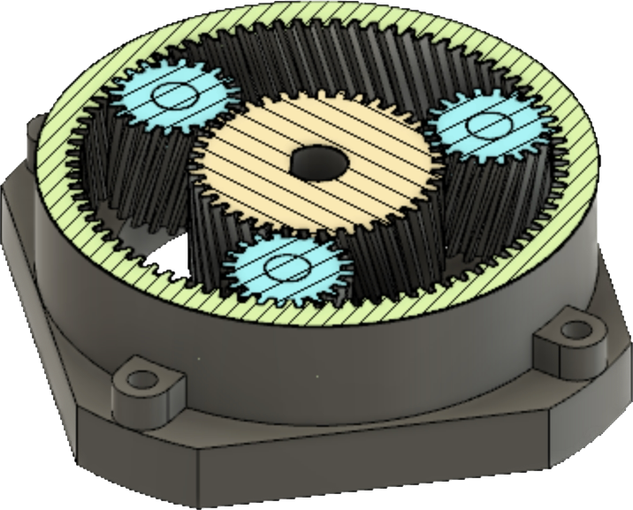

# README

## Project Overview
This project, conducted in 2021, focused on designing and implementing a mechanical hand capable of generating at least 500N of force. Various actuator mechanisms were explored, including Nitinol wire, solenoid actuators, pulleys, and planetary gearboxes. The final design was selected to achieve an optimal balance between power efficiency, force output, weight, and noise levels.

## Actuation Methods Considered

### 1. **Nitinol Arm**
- Uses 6-12V
- Generates 3.43N to 8.9N of force depending on thickness
- Provides 25,000 psi in stress
- Very quiet operation compared to motors
- Weighs 16.561 lb/m²

### 2. **Solenoid Actuator Arm**
- Uses 6V at 0.15 Amps
- Produces 0.7845N of force
- Weighs 14g
- Sound level dependent on final design

### 3. **Pulley System**
- Power draw depends on the motor
- Can multiply force significantly
- Space constraints must be considered
- Generally quiet; noise depends on motor used

### 4. **Planetary Gearbox Arm**
- Power draw depends on the motor
- Can increase force by 3-10 times
- Weight and sound levels depend on final design

## Findings

- **Nitinol Wire**: Provided sufficient force-to-weight ratio but had limitations in control and response time.
- **Solenoid Actuators**: Compact but lacked the necessary force output.
- **Pulley Systems**: Could greatly multiply force but required more space.
- **Planetary Gearbox**: Provided a significant force increase while maintaining a compact design.

## Final Decision
After evaluating the trade-offs, I decided to go with a **Planetary Gearbox** due to its ability to increase torque efficiently while maintaining a reasonable size and power requirement.

## Planetary Gearbox Design

Utilized Fusion 360 to design and model prosthetic hands and a custom 3D-printed gearbox assembly, ensuring mechanical functionality and precision. Led the assembly process and conducted rigorous testing to evaluate performance, durability, and alignment with design requirements.

## Testing and Power efficiency.

| Test    | Mass (kg) | Amps | Voltage (V) | Weight (N) | Torque (Nm) |
| ------- | --------- | ---- | ----------- | ---------- | ----------- |
| Test 1  | 0.873     | 1.1  | 12          | 8.5554     | 1.2833      |
| Test 2  | 1.218     | 1.16 | 12          | 11.9364    | 1.7905      |
| Test 3  | 1.563     | 1.2  | 12          | 15.3174    | 2.2976      |
| Test 4  | 1.814     | 1.3  | 12          | 17.7772    | 2.6666      |
| Test 5  | 2.013     | 1.38 | 12          | 19.7274    | 2.9591      |
| Test 6  | 2.124     | 1.4  | 12          | 20.8152    | 3.1223      |
| Test 7  | 2.196     | 1.45 | 12          | 21.5208    | 3.2281      |
| Test 8  | 2.422     | 1.6  | 12          | 23.7356    | 3.5603      |
| Test 9  | 2.672     | 1.6  | 12          | 26.1856    | 3.9278      |
| Test 10 | 2.977     | 1.7  | 12          | 29.1746    | 4.3762      |
| Test 11 | 3.280     | 1.9  | 12          | **32.144**     | 4.8216      |

## Conclusion

Although I didn’t fully achieve the target Newton force, the project was still a valuable learning experience. Some of the challenges stemmed from the size constraints of the hand and the plastic components wearing down over time. These issues could have been mitigated by selecting a more durable material.